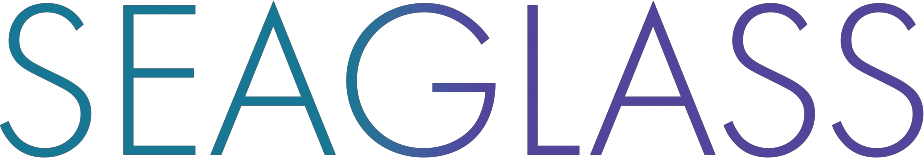

<a name="readme-top"></a>


<!-- PROJECT LOGO -->
<br />
<div align="center">
    

  <p align="center">
    <br>
    Seaglass is under construction. Check back soon!
    <br>
    <br>
    <br>
  </p>
</div>


<!-- ABOUT THE PROJECT -->
## Overview
**Seaglass** is a versatile and user-friendly tool designed for web developers to help them create visually stunning, modern, and immersive user interfaces. Rooted in the elegant design principles of glassmorphism, Seaglass unlocks the potential for web designers and developers to captivate their audiences with translucent and sleek UI elements.

Glassmorphism, characterized by its translucency, glassy backgrounds, and soft blur, has emerged as a dominant design trend in recent years. It effortlessly combines aesthetics, usability, and innovation, making it an ideal choice for crafting user interfaces that leave a lasting impact.

<!-- ![Product Name Screen Shot][product-screenshot] -->

## Key Features
- **Sleek Glassmorphic Design**: The library provides a wide range of CSS styles and components, dedicated to make it easy to achieve glassmorphic design in your web applications.
- **Translucent Elements**: Create elements with varying levels of translucency, adding depth and dimension to your web interfaces.
- **User-Friendly Customization**: The library's classes and components are highly customizable, allowing you to adapt them to suit your unique design requirements.
- **Cross-Browser Compatibility**: Seaglass ensures seamless compatibility with various web browsers, so your glassmorphic designs look as expected for all your users.

<!-- ROADMAP -->
<!-- ## Roadmap

- [ ] 
- [ ] 

<p align="right">(<a href="#readme-top">back to top</a>)</p> -->

<!-- CDN -->
## Include via CDN
```
<link href="https://cdn.jsdelivr.net/gh/QuantumOcean/seaglass_ui/dist/css/seaglass.min.css">
```
<p align="right">(<a href="#readme-top">back to top</a>)</p>


<!-- MARKDOWN LINKS & IMAGES -->
[product-screenshot]: public/images/screenshot.png
[Node.js]: https://img.shields.io/badge/node.js-7FC729?style=for-the-badge&logo=nodedotjs&logoColor=white
[Node-url]: https://nextjs.org/
